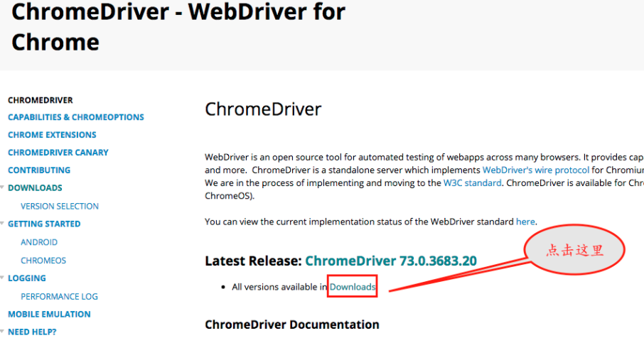
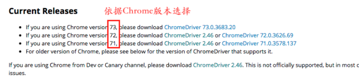
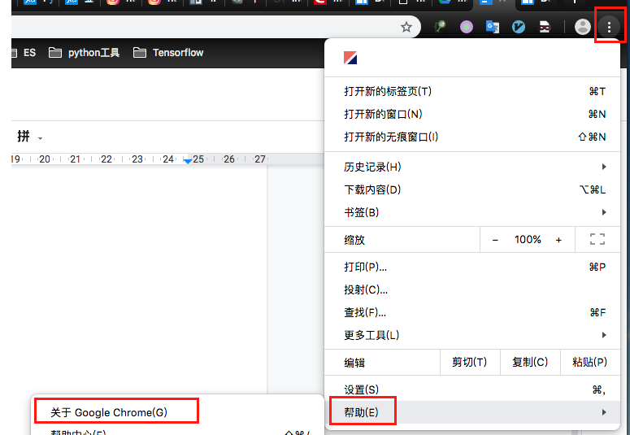
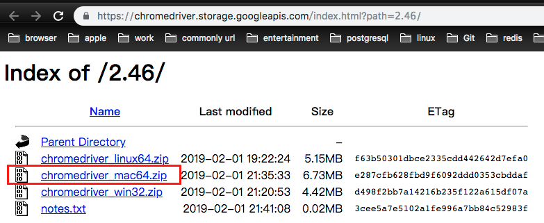

# 安装selenium教程

参考： https://blog.csdn.net/WhereYouSink/article/details/78843656

### 1、安装chrome驱动
- 驱动下载地址：http://docs.seleniumhq.org/download/    选择对应系统的浏览器驱动。「 未探索 」

- 或者直接到：https://sites.google.com/a/chromium.org/chromedriver/ 下载最新版 mac chrome 驱动。「 需翻墙 」

    

    

- 如何查看当前 Chrome 的版本

    
    
- 然后根据你的系统选择所适配的（注：使用 `uname -a` 查看自己的系统是64位还是32位）

    
    
### 2、配置chrome驱动
将解压后的  `chromedriver`  移动到  `/usr/local/bin`  目录下，否则在运行脚本时，会提示 `chromedriver executable needs to be in PATH` 错误。


### 3、安装python库
```bash
pip install selenium
```  
